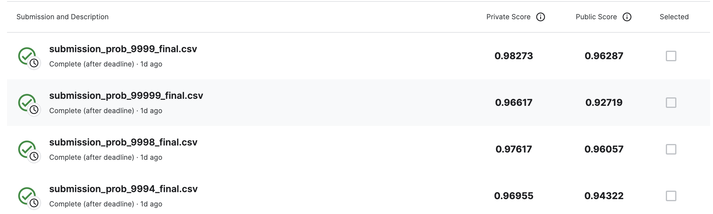

# realfake_numbers
SuperAI SS3 : Hackaton Image processing (Classification) 
train_set - ข้อมูลที่ใช้ในการ Train จำนวน 1001 ภาพ 
test_set - ข้อมูลที่ใช้ในการ Train จำนวน 1010 ภาพ 

sample_submission.csv - ตัวอย่างไฟล์ที่ใช้ส่ง ต้องมีข้อมูลทั้งหมด 1,010 แถว 
0 - หมายถึงภาพปลอม หรือภาพที่ถูกดัดแปลงผ่านวิธีการต่างๆทาง digital 
1 - หมายถึงภาพจริง อาจถูก cropped หรือ resized เท่านั้น 

Load Dataset >>> !kaggle competitions download -c hackathon-online-realfakenumbers

## Copy and finetune knot model

## Classical machine learning F1-Score ~ 0.91
